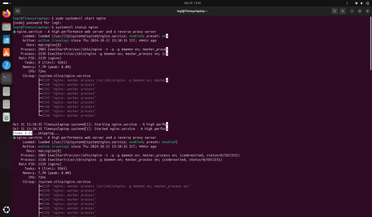

`        `**INSTALLATION OF nginx**

**step1:update the package index**
**
`           `sudo apt update

**step2:Installing nginx**
**
`           `sudo apt install nginx

**step3:Adjusting firewall**
**
`           `sudo ufw app list

**step4:enable nginx HTTP**
**
`           `sudo ufw allow ‘Nginx HTTP’

**step5:verify the changes**
**
`           `sudo ufw status

**step6:checking the status**
**
`           `systemctl status nginx

**step7:confirm the software is running properly**
**
`           `hostname -I

`           `127.0.1.1

**step8:start nginx**

`           `sudo systemctl start nginx

**step9:Enable nginx to start on boot**
**
`           `sudo systemctl enable nginx

**step10:To stop the webserver**

`            `sudo systemctl stop nginx

**step11:To restart the webserver**

`            `sudo systemctl restart nginx        

